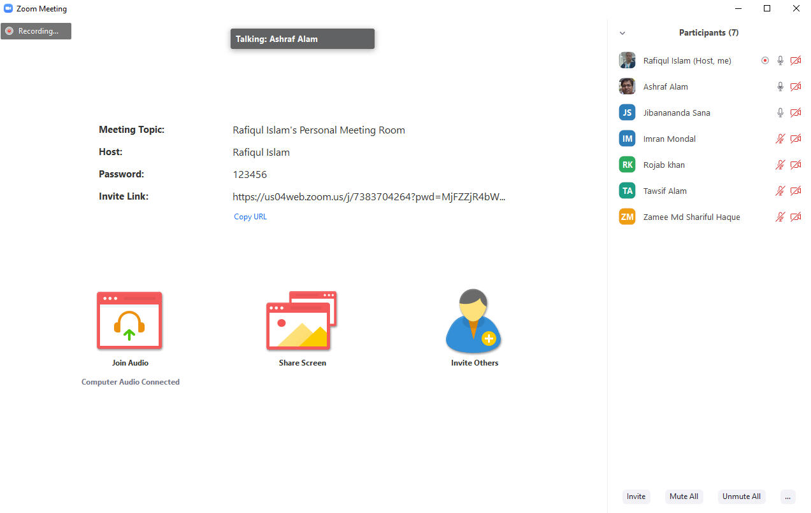
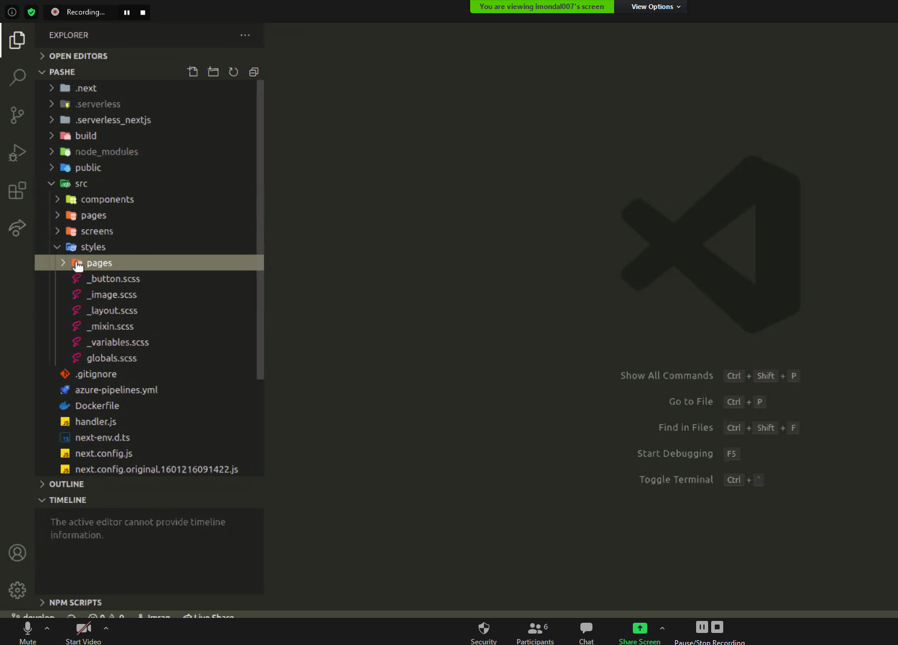
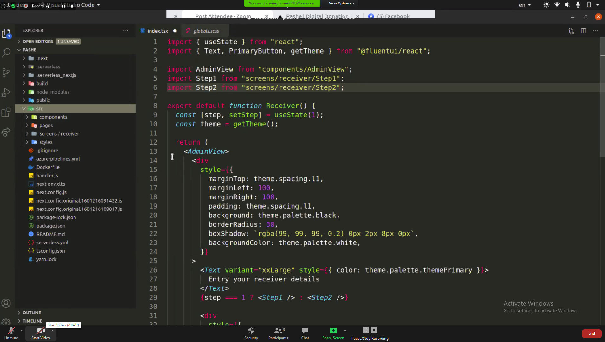
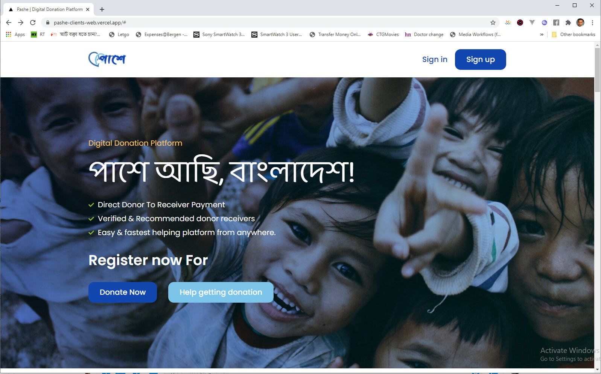
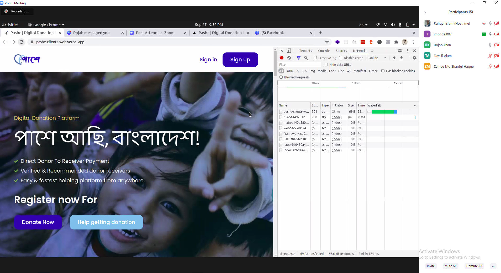

Tonight Pashe UI Exparts(Imran Mondal, Tawsif Alam & Rojab Khan) given a great presentation on Pashe landing page development.
Developers were excitted on the UI architectural session given by Imran Mondal. He explained various benifit os next.js library.  
  
  
 
Finally the Pashe landig page looks like:   
  
  
At the end we set our new target for the team as follows  
1) Pashe landing page will live on next Wednesday 7th Oct 2020 - Imran & Mahmudul Bhai  
2) Doner & Receiver Registration on next Wednesday 14th Oct 2020 - Sana, Tawsif, Zamee & Siddik    
  
  
Click the image below for the recorded session    
    

