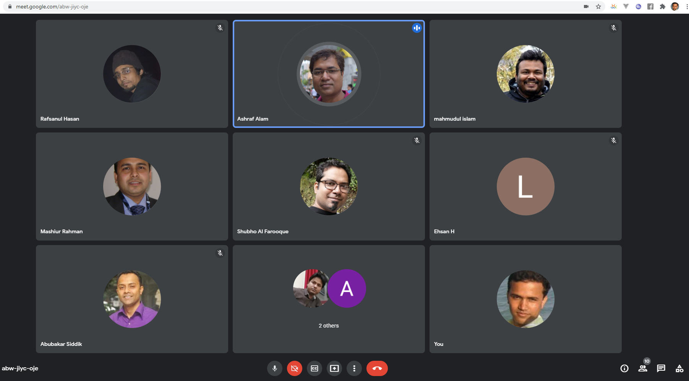

We came up with exciting news for the community that Pashe is coming opensource soon. 
Pashe team really delighted to have our advisor and few technology experts joined 
our team.
Please welcome our advisor [Dr. Mashiur Rahman](https://web.facebook.com/rahman.mashiur)
Mashiur Rahman is an exceptional talented person with great backgroud both research and professional areas, 
worked in Japan, USA and currently working as Engineering Manager at OMRON Healthcare Singapore. 
He is also founder of multiple startups including Quraner Alo and Learn Time. 
Dr. Mashiur bhai will be guiding the core team regarding project management 
and launch strategies.
Additionaly please welcome our technology experts [Rafsanul Hasan](https://web.facebook.com/rafsanulhasanrafsan) & [Delwar Hossain]
Both of them will help us from technology stand points.
  
Few discussion points and decision:
1.	We will launch static pages for now to keep the donation platform running/live. 
	This would help us learning field operation challenges.
2. 	We will complete our ground tasks asap to make Pashe opensource.
4.	Enlisting Pashe as non-profit organization.
3.	Had some discussion  on Pashe running budget arrangement/management. 
Team is very excited! Stay tuned :) 
